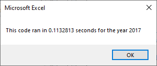
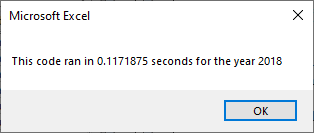

# stock-analysis
## Purpose
To Determine if our script runs more efficiently when we refactor our code from Module 2 for Steve

## Analysis and Challenges
User can check script runtimes using the buttons "Run All Stocks Analysis" and "Run All Stocks Analysis:refactored."
The user will find the runtimes for "Run All Stocks Analysis" for both years to take roughly one second to complete whereas the runestimes for "Run All Stocks Analysis:refactored" is significantly descreased.

### Results below:

**Runtime for refactored script for the year 2017.**

**Runtime for refactored script for the year 2018.**

There are several functions that were left out or editted to help with efficiency.
- First, the major difference between the two scripted is the use of loops. "Run All Stocks Analysis" script uses a system of nested loops that scans the entirety of the dataset (j-loop) 12 times (i-loop); which significantly increases the runtime. Whereas the refactored script uses single loops to scan the entire sheet once.

- Second is the use of arrays. Although this may not be a considerable factor to our runtime, the outputs for the "Run All Stocks Analysis" script is nested in the loop. Meaning, the script runs between accessing data and displaying the result back and forth for each ticker. Contrasting to that, the refactored script stores each individual values in arrays and saves us time going in between sheets and outputting the results.

### Challenges and Difficulties Encountered
It took me some time to fully understand how to utilize loops to work with arrays. As more of a visual person, it helps to draw and outline a plan on paper before tackling the script.

## Summary
Our refactored code does indeed increase efficiency and reduces runtimes to 1/10 of the original. As we can see here, the advantage here for refactoring our code is proven by the runtime differences between the two scripts and generally makes the code easier to understand and read. We used simple loops to complete tasks by saving the values in the indexes of the array instead of using nested loops and swtiching between sheets. We can also use the scripts for other sets of data (2019,2020,2021,etc...) However, there are some limitations to refactoring. Althought I pointed out the clarity of refactored scripts, it took me a while to refactor the codes to work with the arrays. It is easier for codes to break and may take time to debug. Finally, I don't know how different it would work with another data formats. 

